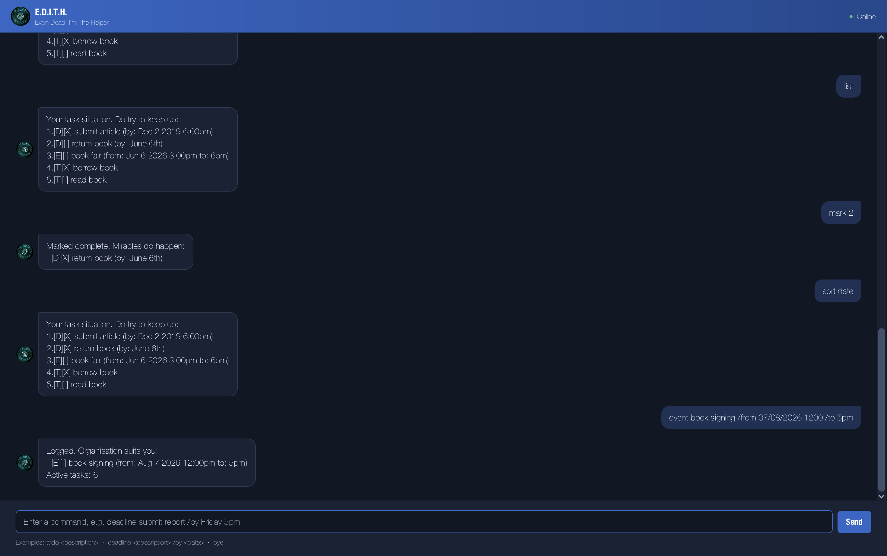

# Edith User Guide

**Edith** is a friendly task-management chatbot for keeping to-dos, deadlines,
and events in one place. Enter a command in the chat input, then press
<kbd>Enter</kbd> or select **Send**. Edith saves your changes automatically, so
your tasks are available the next time you open the app.



## Quick start

1. Start Edith and enter a command in the input box.
1. Add a task, for example:

   ```text
   todo buy groceries
   ```

1. Use `list` to see all tasks.
1. Use `bye` when you are finished. This ends the current Edith session.

> **Tip:** Use `help` at any time to see the command syntax in the app.

## Command format

- Words in `<angle brackets>` are values that you supply.
- Enter exactly one space between command parts. Do not begin or end a command
  with a space.
- Dates must be valid. Edith accepts ISO dates such as `2026-10-05`, date and
  time such as `5/10/2026 1400`, and month-name forms such as `October 5th
  2026 2pm`.
- A month and day without a year, such as `October 5th`, uses the current year.

## Features

### Add a to-do

Adds a task without a date.

**Format:** `todo <description>`

**Example:**

```text
todo buy groceries
```

### Add a deadline

Adds a task with a due date or date and time.

**Format:** `deadline <description> /by <date>`

**Example:**

```text
deadline submit report /by 2026-10-05
deadline pay rent /by October 1st 2026 5pm
```

### Add an event

Adds an event with a start and end. The end must be later than the start. If
the event ends on the same day, you may enter only its end time.

**Format:** `event <description> /from <start> /to <end>`

**Examples:**

```text
event project meeting /from 5/10/2026 1400 /to 5/10/2026 1600
event dinner /from October 5th 2026 7pm /to 9pm
```

### View all tasks

Displays every task in the current order. The number displayed before each
task is used by the `mark`, `unmark`, and `delete` commands.

**Format:** `list`

```text
list
```

### Find tasks

Finds tasks whose descriptions contain a keyword, ignoring letter case.

**Format:** `find <keyword>`

```text
find report
```

### Mark or unmark a task

Marks a task as complete or changes it back to incomplete. Use the task number
shown by `list` or after sorting.

**Formats:**

```text
mark <number>
unmark <number>
```

**Example:**

```text
mark 2
unmark 2
```

### Delete a task

Removes a task permanently from the list.

**Format:** `delete <number>`

```text
delete 3
```

### Sort tasks

Changes the displayed order of the task list. The new order is saved and is
also the order used for task numbers in `mark`, `unmark`, and `delete`.

| Command | Result |
| --- | --- |
| `sort alph` | Sorts descriptions from A to Z, ignoring letter case. |
| `sort alph desc` | Sorts descriptions from Z to A. |
| `sort date` | Sorts deadlines by due date and events by start date; undated to-dos appear last. |
| `sort date desc` | Shows dated tasks from latest to earliest; undated to-dos appear last. |
| `sort status` | Places incomplete tasks before completed tasks. |
| `sort added` | Restores the order in which tasks were added. |
| `sort added desc` | Shows the most recently added tasks first. |

For example:

```text
sort date
```

### Get command help

Displays the syntax of all commands.

**Format:** `help`

```text
help
```

### Exit Edith

Ends the current session.

**Format:** `bye`

```text
bye
```

## Troubleshooting

If Edith rejects a command, check the command format and make sure every
required description, date, delimiter (such as `/by`), and task number is
present. You cannot add an identical task twice, and the `|` character cannot
be used in a task description.

Use `help` to see the available commands again.
